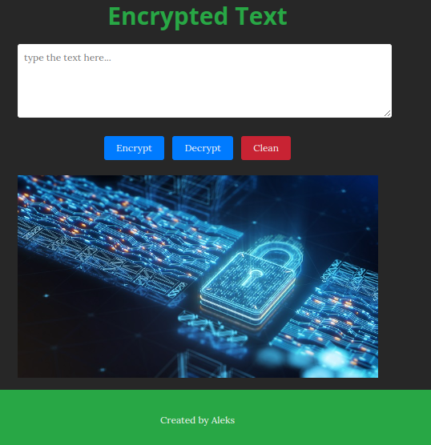
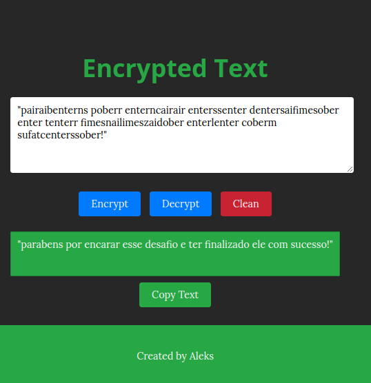

# Text Encoder
Este proyecto es una aplicación web sencilla para criptografar y descriptografar texto utilizando un conjunto básico de reglas de sustitución. El usuario ingresa un texto en un área de texto, y puede criptografarlo o descriptografarlo con botones dedicados. 

## :camera_flash: Screenshots
<!-- You can add more screeenshots here if you like-->
&emsp;

# Tecnología

La aplicación utiliza JavaScript para manejar la lógica de criptografía y manipulación del DOM, HTML para la estructura del contenido, y CSS para el diseño y la apariencia visual.
